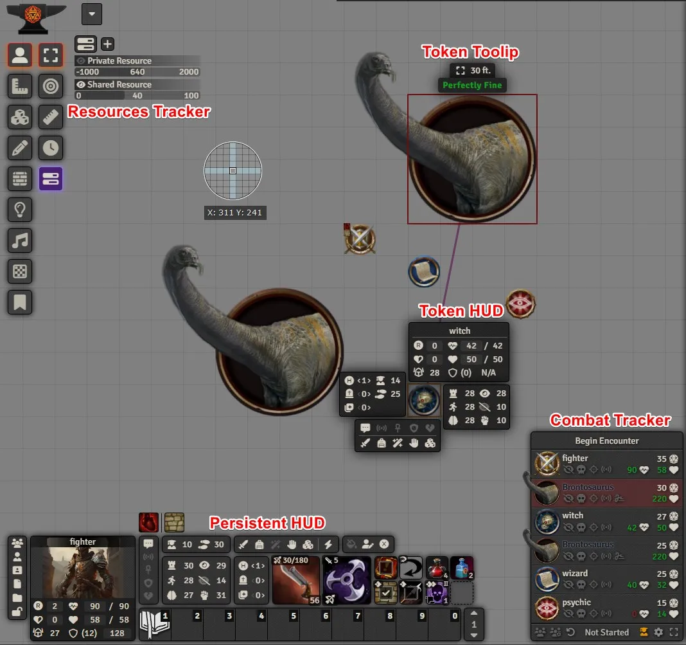

# FoundryVTT PF2e HUD

or [Stripe](https://buy.stripe.com/cN23dy0hd0gW5nq3cc) directly

# WIKI

You can find "not" all the details about this module in its [WIKI](https://github.com/reonZ/pf2e-hud/wiki)

# CHANGELOG

You can see the changelog [HERE](./CHANGELOG.md)
